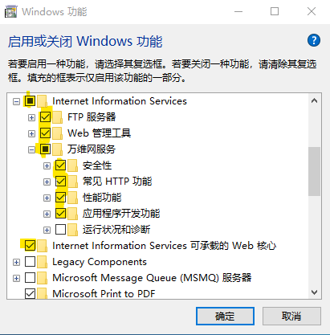

# CognosInstallTips

文档的英文化工作将在教程完成后逐步进行，欢迎提出意见和建议。  
The English version of this doc will start then, welcome for your advice.
## 软件安装与配置
这一部分请参照IBM官网教程进行，暂不做详细介绍，如之后有需要会做相关修改
## Web Server 配置
教程中对这一点的描述可能版本较老，但主要过程差异不大，本教程以win10 1809为例  
选择“控制面板”-“程序”-“程序和功能”-“启用和关闭Windows功能”  
建议勾选请参见教程，以下提供一种方案  
  
服务安装完成后，进入“控制面板”-“系统和安全”-“管理工具”-“Internet Information Service 管理工具”  
  
添加新的虚拟网页，将网页物理地址绑定到Cognos的目录下的webcontent。  
  
在虚拟网页的根目录下建立虚拟网页，绑定到根目录下的"cgi-con"。  
  
网站根目录下的"iSCSI和IIS访问权限控制"，将控制改为允许。  
  
权限控制将两个允许勾选上。  
  
